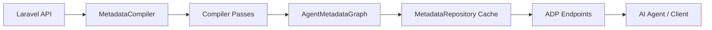

# 🚀 Ronu Laravel Agent Protocol

**Laravel SDK para exponer APIs como metadatos consumibles por agentes de IA.**

`ronu/laravel-agent-protocol` convierte una API Laravel en una API
auto-descriptiva mediante el **Agent Discovery Protocol (ADP)**.

La idea es simple: antes de que un agente de IA consulte tu API, primero puede
descubrir qué recursos existen, qué operaciones soportan, qué filtros aceptan,
qué validaciones aplican y qué relaciones puede cargar.

---

## 🧠 ¿Qué problema resuelve?

Cuando un agente recibe una pregunta como:

> “Dame todos los usuarios activos que faltaron en septiembre”

no debería inventar endpoints, filtros ni campos.

Este paquete permite que el agente consulte `/agent` y descubra:

- qué recursos existen;
- qué endpoints puede usar;
- qué escenarios soporta cada recurso;
- qué filtros acepta la API;
- qué relaciones están permitidas;
- qué reglas de validación aplican;
- qué errores puede recibir;
- qué términos semánticos conoce el sistema.

Así el conocimiento vive en el backend, no en prompts escritos a mano.

---

## ✅ Qué es

Este paquete es un **SDK Laravel de descubrimiento de capacidades**.

Funciona como una capa de metadatos sobre APIs Laravel, especialmente APIs
construidas con:

```text
ronu/rest-generic-class
```

Expone información útil para agentes, automatizaciones, SDKs cliente,
documentación dinámica y herramientas internas.

---

## ❌ Qué no es

Este paquete **no**:

- implementa agentes de IA;
- ejecuta consultas por el agente;
- crea CRUD;
- reemplaza `ronu/rest-generic-class`;
- modifica datos;
- genera prompts específicos por entidad.

Su responsabilidad es una sola:

> publicar metadatos confiables para que un agente pueda entender cómo usar tu API.

---

## ✨ Qué publica

El endpoint ADP expone un grafo de metadatos con:

| Metadato | Fuente principal |
|---|---|
| Módulos | Configuración y rutas Laravel |
| Recursos | Modelos, rutas y configuración |
| Campos | Eloquent, casts, fillables y reglas |
| Relaciones | `BaseModel::RELATIONS` |
| Escenarios | FormRequest / `BaseFormRequest` |
| Validaciones | `getRulesForScenario()` |
| Capacidades | Operaciones, soft delete, jerarquía, exportación |
| Filtros | Gramática de `rest-generic-class` |
| Diccionario | Configuración o providers personalizados |
| Errores | Contrato ADP documentado |

---

## ⚙️ Requisitos

- PHP `^8.3`
- Laravel 11 o 12
- Composer
- Recomendado: `ronu/rest-generic-class`

---

## 📦 Instalación

```bash
composer require ronu/laravel-agent-protocol
```

Publica la configuración:

```bash
php artisan vendor:publish --tag=agent-protocol-config
```

Compila la metadata:

```bash
php artisan agent:cache
```

Valida el contrato:

```bash
php artisan agent:validate
```

---

## 🧩 Ejemplo de configuración

```php
// config/agent-protocol.php

'resources' => [
    'security.user' => [
        'module' => 'security',
        'model' => App\Models\User::class,
        'request' => App\Http\Requests\UserRequest::class,
        'endpoint' => '/api/security/users',
        'description' => 'Usuarios administrados por el módulo de seguridad.',
    ],
],
```

También puede descubrir recursos desde rutas Laravel si tus controladores:

- extienden `Ronu\RestGenericClass\Core\Controllers\RestController`;
- declaran la propiedad `$modelClass`;
- usan escenarios y FormRequests compatibles.

---

## 🌐 Endpoints disponibles

```text
GET /agent
GET /agent/modules
GET /agent/resources
GET /agent/resources/{resource}
GET /agent/resources/{resource}/operations
GET /agent/resources/{resource}/operations/{scenario}
GET /agent/documentation/filter
GET /agent/documentation/errors
GET /agent/dictionary
```

Ejemplo:

```bash
curl http://localhost/agent/resources/security.user
```

---

## 🧾 Ejemplo de metadata

```json
{
  "key": "security.user",
  "module": "security",
  "name": "user",
  "model": "App\\Models\\User",
  "table": "users",
  "primary_key": "id",
  "capabilities": {
    "query": true,
    "create": true,
    "update": true,
    "delete": true,
    "restore": true,
    "soft_deletes": true,
    "filters": ["eq", "attr", "oper", "relations", "select", "pagination", "orderby"]
  }
}
```

---

## 🔍 Filtros para agentes

La documentación de filtros se expone en:

```text
GET /agent/documentation/filter
```

Incluye la gramática usada por `rest-generic-class`:

```json
{
  "oper": {
    "and": [
      "status|=|active",
      "created_at|between|2026-09-01,2026-09-30"
    ]
  },
  "relations": ["department:id,name"],
  "select": ["id", "name", "email"]
}
```

Esto permite que un agente transforme lenguaje natural en filtros válidos sin
adivinar la sintaxis.

---

## 🧠 Diccionario semántico

Puedes registrar términos humanos para ayudar al agente:

```php
'dictionary' => [
    'activos' => [
        'field' => 'status',
        'operator' => '=',
        'value' => 'active',
    ],
],
```

Disponible en:

```text
GET /agent/dictionary
```

---

## 🛠️ Comandos Artisan

```bash
php artisan agent:cache
php artisan agent:clear
php artisan agent:validate
php artisan agent:export storage/app/agent-metadata.json
```

| Comando | Uso |
|---|---|
| `agent:cache` | Compila y guarda la metadata |
| `agent:clear` | Limpia la cache ADP |
| `agent:validate` | Valida recursos, módulos y operaciones |
| `agent:export` | Exporta el grafo ADP como JSON |

---

## 🏗️ Arquitectura interna



El diseño evita hacer reflection en cada request. Primero se compila un
`AgentMetadataGraph`, luego los endpoints leen ese grafo desde cache.

---

## 🧪 Calidad

El paquete incluye:

- PHPUnit / Pest;
- PHPStan en nivel máximo;
- Laravel Pint;
- Rector;
- GitHub Actions;
- tests unitarios iniciales del compilador, DTOs y validador ADP.

Ejecutar checks:

```bash
vendor/bin/pest
vendor/bin/phpstan analyse
vendor/bin/pint --test
```

---

## 📚 Documentación

Documentación principal:

- [Instalación](docs/INSTALL.md)
- [Quickstart](docs/QUICKSTART.md)
- [Arquitectura](docs/ARCHITECTURE.md)
- [Discovery](docs/DISCOVERY.md)
- [Protocolo](docs/PROTOCOL.md)
- [Endpoints](docs/ENDPOINTS.md)
- [Providers](docs/PROVIDERS.md)
- [Cache](docs/CACHE.md)
- [Code Archaeology](docs/CODE_ARCHAEOLOGY.md)

---

## 🎯 Objetivo del proyecto

El objetivo de `ronu/laravel-agent-protocol` es que tus APIs Laravel sean
comprensibles para agentes de IA sin escribir prompts específicos para cada
entidad.

El backend declara sus capacidades.

El agente las descubre.

La API sigue siendo la fuente de verdad.
