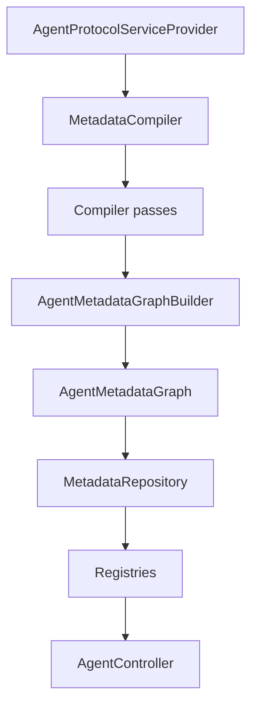

# Architecture

This package is intentionally metadata-only.

It does not run queries, mutate records or proxy requests. Existing API behavior
remains owned by Laravel and `ronu/rest-generic-class`; this package compiles and
publishes an immutable metadata graph for external agents.

## Main Components

## Layers

`DTO`
: Immutable descriptors such as `ResourceDescriptor`, `OperationDescriptor`,
`FieldDescriptor`, `RelationDescriptor` and `AgentMetadataGraph`.

`Metadata`
: Compilation pipeline. `MetadataCompiler` runs compiler passes and writes into
`AgentMetadataGraphBuilder`.

`Metadata\Introspection`
: Reflection and Laravel inspection. It reads Eloquent models, relation
allowlists and scenario rules without executing API operations.

`Cache`
: `MetadataRepository` caches the compiled graph so requests never run full
reflection when cache is enabled.

`Registry`
: Read models for controllers. Controllers do not inspect Laravel directly.

`Http`
: `AgentController` exposes the ADP HTTP contract.

`Console`
: Artisan commands for cache, validation and export.

## RestGenericClass Reuse

The implementation reuses the existing conventions instead of copying runtime
logic:

- `RestController` route discovery identifies resources from `$modelClass`.
- `BaseModel::MODEL` names resources.
- `BaseModel::RELATIONS` defines allowed relations.
- `BaseModel::HIERARCHY_FIELD_ID` exposes hierarchy capability.
- `BaseModel::getSoftDeleteColumn()` exposes soft-delete metadata.
- `BaseFormRequest`-style scenario methods expose validation rules.
- `rest-generic-class.filtering.allowed_operators` powers filter docs.

## Design Choice

The most important decision is compiling one `AgentMetadataGraph` first and
serving all endpoints from it. This keeps ADP endpoints fast, testable and easy
to export to JSON, OpenAPI or JSON Schema later.
