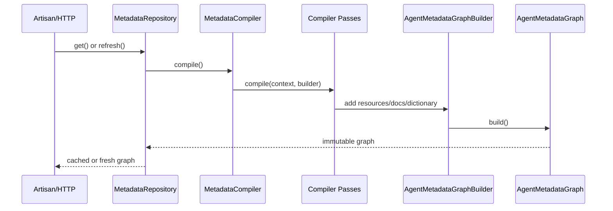

# Internal Flow

## Why This Flow

Reflection and route scanning are expensive and should not happen on every ADP
HTTP request. `MetadataRepository` owns cache behavior, while controllers read
from registries backed by the already-compiled graph.
